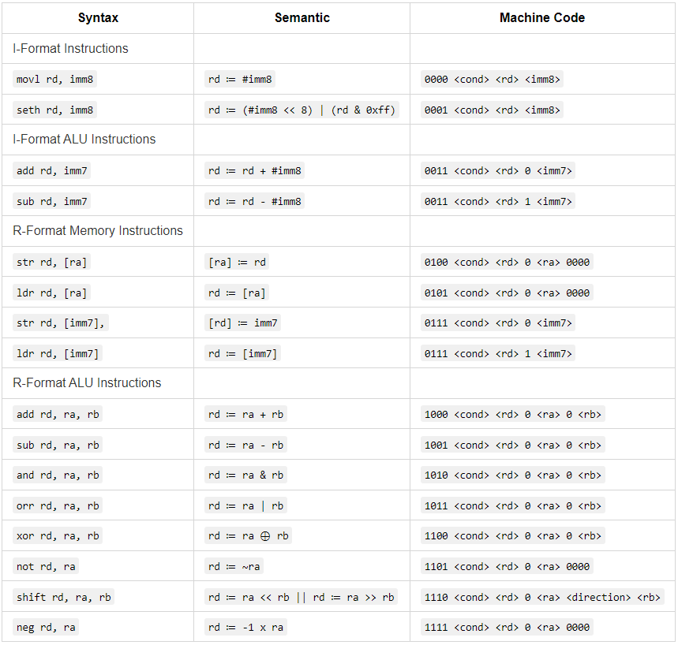
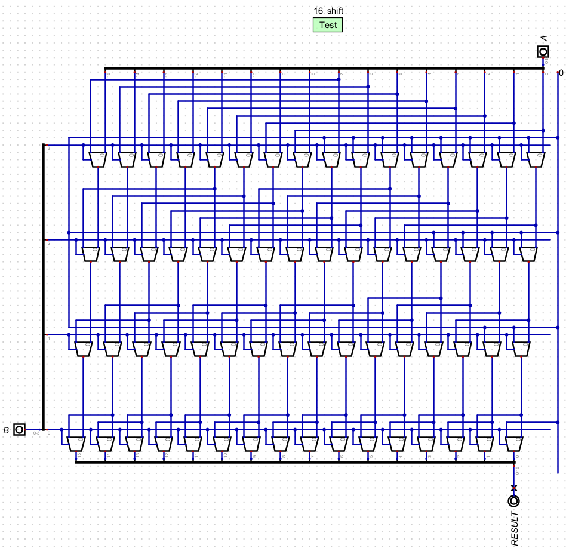

# Custom CPU Design Report with Extended ISA

In this report, we will discuss the design, implementation, and analysis of a custom CPU built using a circuit design program. The custom CPU meets the assignment specifications by providing a unique architecture tailored to optimize performance and efficiency. This custom CPU extends the base ISA with additional ALU operations, logical shifts, and support for both ALU, I-Mode Memory Instructions and PC relative jumps, while maintaining backward compatibility with the base ISA.

### General benefits

- Additional ALU operations: The extended ISA offers more arithmetic and logical operations, broadening the CPU's capabilities and enabling more efficient task execution.

- Logical shifts: The extra bit for direction allows both left and right shifts, providing greater flexibility in data manipulation and improved performance in certain tasks.

- ALU immediates && I-Mode Memory Instructions: Immediate values support for ALU and Memory instructions leads to more efficient operations with constant values, saving clock cycles and enhancing performance.

- PC-relative jump: The inclusion of a PC-relative jump instruction allows for more flexible control flow by adjusting the program counter based on its current value. This feature simplifies branching and improves code efficiency.

## Implementation

The custom CPU uses the following extended ISA while maintaining backward compatibility with the base ISA:



One of the key improvements in the extended ISA over the base ISA is the inclusion of more ALU operations, such as XOR, NOT, SHIFT and NEG. This extended set of operations allows the CPU to perform a wider range of tasks more efficiently, enabling complex arithmetic and bitwise operations that can significantly enhance overall performance.

In addition to the expanded ALU operations, the extended ISA introduces logical shifts with an extra bit to indicate the direction. This provides a more flexible approach to shifting bits in registers, ultimately making it easier to perform tasks such as multiplication, division, or data manipulation.



Another benefit of the extended ISA is the inclusion of both ALU and I-Mode Memory Instructions. The ability to use immediate values in ALU and memory instructions simplifies the instruction set and reduces the need for additional load instructions to access immediate values. This can lead to a more efficient execution of the program, as fewer instructions are needed for certain tasks.

Finally for PC relative jump. This utilizes the ALU immediates from before to make the following new `pseudo` instructions

```json
"JPRB": {
    "syntax": "JPRB? <IMM7:uint7>",
    "machine": "0011 C 111 1 IMM7",
    "semantic": "PC := PC - IMM7",
    "description": "Jump the PC backward relative to the PC's current value. (alias for `ADD PC, PC, IMM7`)",
    "pseudo": true,
    "class": "imm"
},
"JPRF": {
    "syntax": "JPRF? <IMM7:uint7>",
    "machine": "0011 C 111 0 IMM7",
    "semantic": "PC := PC + IMM7",
    "description": "Jump the PC forward relative to the PC's current value. (alias for `ADD PC, PC, IMM7`)",
    "pseudo": true,
    "class": "imm"
}
```

## Design

A key aspect of the design process was the use of subcircuits for encapsulation. This approach allowed for the organization of the various components and functionalities into smaller, more manageable units, ultimately resulting in a cleaner and more modular design. The use of subcircuits also made it easier to maintain and troubleshoot the custom CPU, as each functional block could be isolated and tested independently.

Another important design consideration was the adoption of a BUS-like technique for wiring and interconnections between components. This method enabled efficient communication between different parts of the custom CPU, reducing signal propagation delays and minimizing the impact of long wire lengths on performance. The BUS-like approach also contributed to a more organized layout, making it easier to follow the flow of data and control signals throughout the CPU.

Consistent use of terminals was another essential aspect of the custom CPU design. Terminals were employed for wires that had to loop back as well as for control lines, ensuring that connections were made correctly and reducing the risk of miswiring. This practice not only streamlined the control signal routing but also minimized duplicate wires, resulting in a cleaner and more organized layout. Consequently, this contributed to the clarity and simplicity of the custom CPU design, enhancing maintainability and easing the debugging process.

## Analysis

In the process of extending the ISA, we faced certain limitations due to the design choices made. These limitations prevented us from further expanding the capabilities of the custom CPU and implementing additional features.

- Limited register files: Using bits for the shifter and immediates in the extended ISA resulted in a trade-off where we could not add significantly more register files. This constraint impacted the custom CPU's ability to handle a larger number of variables and intermediate values simultaneously, which in turn could affect the overall performance and efficiency of the CPU.

- Constraints on new extensions: The design decisions made to extend the ISA with new features and improvements limited the available options for implementing other potential extensions. For instance, using bits for the shifter and immediates consumed part of the opcode space, reducing the number of available opcodes for future instructions. This restriction makes it challenging to expand the ISA further, especially when trying to maintain backward compatibility with the base ISA.

- Backward compatibility: Maintaining compatibility with the base ISA imposed restrictions on the addition of new instructions or modifications to existing instructions. This limitation might have influenced the design choices made while extending the ISA, potentially leading to suboptimal designs or limiting the overall performance improvements that could be achieved.

Despite these limitations, the extended ISA successfully provides additional ALU operations, logical shifts, and support for ALU and Memory immediates, which contribute to the custom CPU's enhanced performance and flexibility. However, it is essential to acknowledge the trade-offs made in the design process to achieve these improvements while understanding the impact of these choices on the CPU's overall capabilities.
